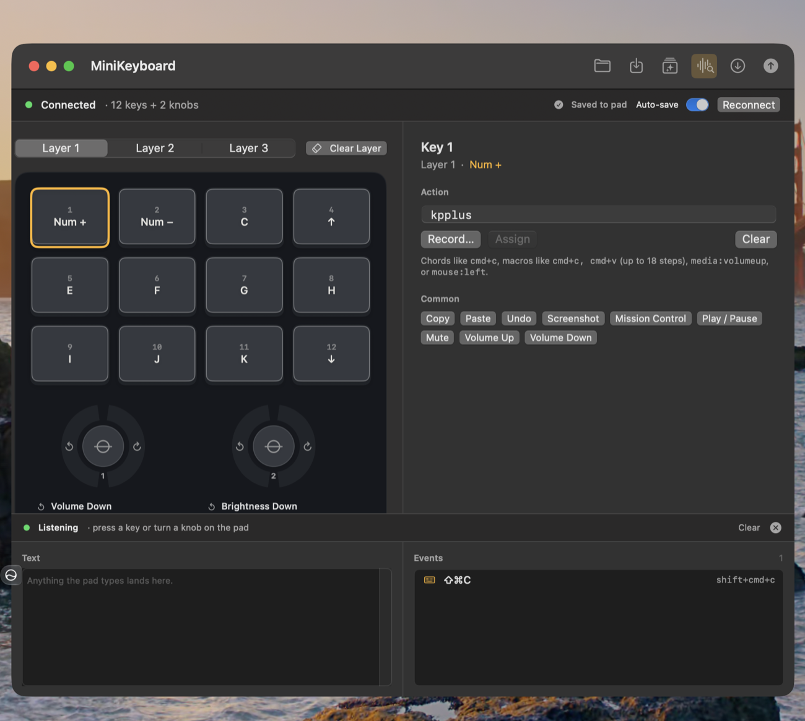

# MiniKeyboard

A native macOS app and command-line tool for the cheap USB macro pads sold under
a hundred different names — 3 to 16 keys, plus rotary knobs, three layers,
per-layer backlighting.

The configurator they ship with is a 38 MB Qt app built for Intel only, so it
runs under Rosetta — which macOS 28 removes. Launch it today and macOS already
warns you. This is a ground-up rewrite: Swift, SwiftUI, IOKit, no third-party
dependencies, universal binary, **3.7 MB**.



---

## Contents

- [Why](#why) · [Requirements](#requirements) · [Install](#install)
- [Quick start](#quick-start) · [The app](#the-app) · [The CLI](#the-cli)
- [Actions](#actions) · [Profiles](#profiles) · [Presets](#presets)
- [Lighting](#lighting) · [Keystroke delay](#keystroke-delay)
- [Supported hardware](#supported-hardware) · [Troubleshooting](#troubleshooting)
- [The protocol](#the-protocol) · [How it was reverse engineered](#how-it-was-reverse-engineered)
- [Parity with the original](#parity-with-the-original) · [Development](#development)
- [FAQ](#faq) · [License](#license)

---

## Why

| | Original | MiniKeyboard |
|---|---|---|
| Architecture | x86_64 only, needs Rosetta | Universal arm64 + x86_64 |
| macOS 28 | Will not launch | Native |
| Size | 38 MB | 3.7 MB |
| Dependencies | Qt 5.12.9, libhidapi | None — IOKit directly |
| Saving a layout | Not possible | JSON profiles |
| Scripting | None | Full CLI |
| Apply speed | ~3 s (a 1-second sleep per layer) | Immediate |
| Tests | None | 57, none needing hardware |

The original blocks its own UI thread with `QThread::sleep(1)` after each layer.
That is the whole reason it feels frozen when you hit Download.

## Requirements

- macOS 14 or later
- A supported pad (see [Supported hardware](#supported-hardware))
- To build: Xcode 16+ or the Swift 6 toolchain

No kernel extension, no driver, no admin rights. The pad's configuration
interface is vendor-defined HID, which macOS lets any app open.

## Install

```sh
git clone https://github.com/bhaveshnigam/MiniKeyboard.git
cd MiniKeyboard
make install          # app into /Applications, CLI into /usr/local/bin
```

Or build the pieces separately:

```sh
make                  # library, CLI and app for this Mac
make app              # dist/MiniKeyboard.app
make universal        # arm64 + x86_64
make dist             # packaged zip, universal
make test             # 57 tests, no hardware required
make install-cli      # just the CLI
make uninstall
```

`make install` needs write access to `/usr/local/bin`; prefix with `sudo`, or
point it elsewhere with `make install PREFIX=~/.local`.

The app is ad-hoc signed, so Gatekeeper may object on first launch. Right-click
it and choose Open.

## Quick start

```sh
minikeyboard list                    # is the pad there?
minikeyboard read > backup.json      # ALWAYS do this first
minikeyboard set 1 cmd+c             # program key 1
minikeyboard apply backup.json       # put everything back
```

**Back up before experimenting.** The pad holds the only copy of its own
configuration, and `read` is the only way to get it off. One exception: the
backlight cannot be read back, so note your lighting separately.

## The app

Open MiniKeyboard and it finds the pad, reads its current layout and draws it to
match the hardware.

- **Layer 1 / 2 / 3** — the pad stores three independent layers. You switch
  layers on the device itself; this picks which one you are editing.
- **Keys and knobs** — click one to select it. A knob is drawn as a dial with
  three regions: turn left, press, turn right.
- **Inspector** — the action for the selected key. Type it, pick a common one,
  or hit **Record…** and press the shortcut on your Mac keyboard.
- **Presets** — ready-made shortcut sets for common apps.
- **Lighting** — effect and colour for the current layer, written immediately.
- **Clear Layer** — empties the current layer, after a confirmation.
- **Auto-save** — on by default. Every edit is written to the pad shortly after
  you stop, so **Apply** (⌘S) is only there to force a write early. Turn it off
  and the status bar goes back to reporting **Unsaved changes**.
- **Read** (⌘D) pulls the pad's current layout back in.
- **Test** (⇧⌘T) shows what the pad actually sends.

The pad is the only place a layout lives, so leaving edits unwritten is the
surprising behaviour, not the safe one — hence auto-save on by default. Lighting
has always been written as you click, because you judge it by looking at it.

### Testing what a key actually sends

**Test** (⇧⌘T) opens a listener in the bottom of the window. Press a key or turn a knob on the pad and it
reports what reached the Mac — the readable form and the exact binding token
side by side — while anything the pad types lands in a text area, so a macro's
content and its timing are both visible.

As far as macOS is concerned the pad is just a keyboard; there is no way to ask
it what it just sent. Watching the events it produces is the only way to confirm
a binding does what you meant, which is why this exists. It catches keys,
chords, wheel and pan from a knob, middle click, and media keys.

### Seeing what a key is for

Fill a layer from a preset and the keys show **what the shortcut does**, not just
the chord: "Toggle mute" with `⇧⌘M` underneath it. A badge above the pad names
whose shortcuts these are, and **Clear labels** drops the labelling while keeping
the bindings.

Labels live in the profile, not on the pad. The firmware genuinely has nowhere to
put them: every byte of a key record it does not recognise is zeroed on write —
spare bytes 6 to 8 and the tail past the macro steps all read back as zero — so
a template marker cannot be stashed on the device. Tested, not assumed.

Two things cover for that:

- **A local cache.** The last layout written to a pad is kept in
  `~/Library/Application Support/MiniKeyboard`, keyed by product id and shape,
  so labelling survives quitting the app.
- **Recognition.** With no cache — a pad set up on another machine, or a cleared
  cache — the bindings themselves are the evidence. If most of a layer matches a
  known preset it is labelled anyway, and the badge hedges with *"Looks like
  Microsoft Teams"* rather than asserting it.

  Matching is order-independent, so keys can be moved around or a few swapped
  out and it still recognises the set. It needs at least three matches, half the
  layer, and a clear margin over the runner-up, so a couple of shared shortcuts
  like `⌘C` never trigger it.

Reading from the device keeps a label only where the binding still matches, and
rebinding a key clears its label rather than leaving "Mute" on something that no
longer mutes.

## The CLI

```
Device
  list                          Show connected pads and their geometry
  read [--layer N]              Read the pad's current config as JSON
  apply <profile.json>          Write a profile to the pad
  set <key> <action> [--layer N] [--delay MS]
                                Program one key
  clear                         Clear every key on every layer

Lighting
  led <mode> [--color C] [--layer N]    Set the backlight
  led --list                            Show every effect and colour
  led-layers                            Give each layer its own colour

Presets
  presets                       List built-in shortcut sets
  presets <app>                 Show one app's shortcuts
  preset <app> [--layer N]      Write an app's shortcuts to a layer
  cheatsheet [app]              Print a Markdown cheatsheet

Offline
  validate <profile.json>       Parse a profile without touching hardware
  keys                          List every key name the parser accepts

Diagnostics
  doctor                        Show HID interfaces and dump raw traffic
  variant [<keys> <knobs>]      Show or set the pad's declared model
  raw <hex...> [--commit]       Send a raw report, for protocol work
```

Key indices are **1-based**. Layers on the command line are **0-based**
(`--layer 0` is the pad's Layer 1).

## Actions

| Form | Example | Notes |
|---|---|---|
| Single key | `a`, `f5`, `space`, `kpplus` | `minikeyboard keys` lists them all |
| Chord | `cmd+c`, `ctrl+shift+a` | |
| Macro | `"cmd+c, cmd+v"` | Up to 18 steps; quote it |
| Media | `media:volumeup`, `media:playpause` | 16-bit HID Consumer usages |
| Mouse | `mouse:left`, `mouse:wheelup` | left, right, middle, wheelup, wheeldown |
| Horizontal scroll | `mouse:scrollleft`, `mouse:scrollright` | Shift plus wheel, which is how macOS pans |
| Modified wheel | `ctrl+mouse:wheelup` | |
| Clear | `none` | |

Modifiers are `ctrl`, `shift`, `alt`/`option`, `cmd`/`win`. Prefix with `r` for
the right-hand variant (`rshift+a`).

Two spellings exist for a reason: **`displayName`** is the canonical token you
type and that profiles store (`kpplus`), while **`displayLabel`** is what the UI
shows (`Num +`, `⌘C → ⌘V`). They round-trip, so what you read and what you can
type never drift apart.

## Profiles

Plain JSON, diffable, safe in a dotfiles repo.

```json
{
  "name" : "Editing",
  "geometry" : { "keyCount" : 12, "knobCount" : 2 },
  "assignments" : [
    { "key" : 1,  "layer" : 0, "action" : "cmd+c" },
    { "key" : 5,  "layer" : 0, "action" : "cmd+c, cmd+v", "delay" : 200 },
    { "key" : 16, "layer" : 0, "action" : "media:volumedown" }
  ],
  "leds" : [
    { "layer" : 0, "mode" : 1, "color" : 4 }
  ]
}
```

| Field | Meaning |
|---|---|
| `key` | Wire slot, 1-based. See the slot map below |
| `layer` | 0, 1 or 2 |
| `action` | Any form from [Actions](#actions) |
| `delay` | Optional, 0–6000 ms between macro keystrokes |
| `label` | Optional, what the binding is for — presets supply it |
| `leds` | Optional, one entry per layer |
| `layerSources` | Optional, which preset filled each layer |

Every field except `key`, `layer` and `action` is optional, and profiles written
before a feature existed still load.

### Slot map

Keys occupy slots **1–15** regardless of how many the pad has. Knobs start at
**16**, three slots each:

| Knob | Turn left | Press | Turn right |
|---|---|---|---|
| 1 | 16 | 17 | 18 |
| 2 | 19 | 20 | 21 |
| 3 | 22 | 23 | 24 |

So on a 12-key/2-knob pad the valid slots are 1–12 and 16–21. This is fixed by
the firmware, not derived from the key count.

## Presets

Sixteen ready-made shortcut sets: macOS, text editing, Slack, Teams, Zoom,
Google Meet, Discord, Lightroom Classic, Photoshop, Final Cut Pro, DaVinci
Resolve, Figma, VS Code, browsers, Excel and OBS.

```sh
minikeyboard presets                       # ✓ marks apps found on this Mac
minikeyboard presets lightroom             # keys and knobs for one app
minikeyboard preset lightroom --layer 1    # fill a whole layer
minikeyboard preset teams --export > t.json  # no hardware needed
```

### Knobs

Presets define their knobs separately from their keys, because a rotary encoder
needs something worth repeating. Filling knobs from the same flat list as the
keys is how you end up with "Search" on a knob turn.

| App | Knob 1 | Knob 2 | Knob 3 |
|---|---|---|---|
| macOS | Volume | Brightness | Scroll |
| Lightroom Classic | Photos — prev / pick / next | Scroll | Filmstrip — pan |
| Photoshop | Brush size | Zoom | Scroll |
| Final Cut, Resolve | Playhead — frame step | Timeline zoom | Scroll |
| Zoom, Teams, Meet, Discord | Volume, press to mute | Scroll | Pan |
| Slack | Unread channels | Scroll | Volume |
| Browsers | Scroll | Tabs | Zoom |
| VS Code | Scroll | Editors | Pan |

A test asserts every rotation is a repeatable action, so a one-shot command
cannot end up on a turn.

In the app, **Presets** opens a browser. Apps installed on this Mac are listed
first with their own icons; the rest stay available, since you might be setting
up a pad for another machine. Detection asks LaunchServices, with a name-match
fallback for Adobe (whose bundle ids change between releases). It is local,
needs no permissions and sends nothing anywhere.

Shortcuts are macOS defaults at the time of writing. Apps let people rebind
theirs and vendors change defaults, so treat a preset as a starting point.
[`docs/CHEATSHEET.md`](docs/CHEATSHEET.md) is the generated reference, and a test
asserts every entry parses and survives the wire format.

## Lighting

Six effects, seven colours, set per layer.

| Effect | | Colour | |
|---|---|---|---|
| 0 | Off | 1 | Red |
| 1 | Solid | 2 | Orange |
| 2 | Wave — lights run along the keys and back | 3 | Yellow |
| 3 | Wave reverse | 4 | Green |
| 4 | Reactive — lights only the key you press | 5 | Cyan |
| 5 | Rainbow — every colour at once, reads as white | 6 | Blue |
| | | 7 | Purple |

Off and Rainbow ignore the colour.

```sh
minikeyboard led solid --color green
minikeyboard led reactive --layer 1
minikeyboard led --list
```

### Colour-coded layers

The layer is switched on the pad and nothing on screen reflects it, so which
layer is live is the one bit of state that is easy to lose track of.

```sh
minikeyboard led-layers      # layer 1 green, layer 2 blue, layer 3 red
```

Those three are the most separable of the seven, and differ in lightness as well
as hue, so they stay distinguishable with the common forms of colour blindness.

**The backlight cannot be read back.** The device never returns slot 0, so the
app shows what it last set, not what the hardware is doing.

## Keystroke delay

A macro can carry a gap between its keystrokes, 0–6000 ms, because some apps
drop input sent at full speed.

```sh
minikeyboard set 5 "cmd+c, cmd+v" --delay 200
```

In the app a slider appears in the inspector once a key holds more than one
keystroke.

## Supported hardware

USB vendor `0x1189`, products `0x8840`, `0x8842`, `0x8830`–`0x8833`, `0x8850`,
`0x8851`. Developed and verified against a **12-key / 2-knob pad (`1189:8842`)**.

The firmware accepts fourteen geometries — 2+0, 3+1, 4+0, 4+1, 5+0, 6+0, 6+1,
6+2, 9+2, 9+3, 11+3, 12+2, 12+3, 15+3 — and the app draws whichever the pad
reports, so other variants should work. If yours does not, `minikeyboard doctor`
output is the thing to open an issue with.

## Troubleshooting

**`No supported pad found`** — check it is plugged in, then run
`minikeyboard doctor`. It lists every matching HID interface. The configuration
interface is the one with usage page `0xFF00`.

**Commands are accepted but nothing happens** — you are probably talking to the
keyboard interface rather than the vendor one. `doctor` shows both.

**The pad reports the wrong number of keys** — `minikeyboard variant` shows its
declared model and can set it. Only do this if it is genuinely wrong: telling a
pad it has keys it does not have leaves it describing keys that are not there.

**Gatekeeper blocks the app** — it is ad-hoc signed. Right-click, Open.

**A macro types nothing, or drops characters** — add `--delay 100` or more.

**I lost my layout** — if you took a backup, `minikeyboard apply backup.json`.
If not, there is no copy anywhere else. Take one now.

---

## The protocol

Documented here because it is not written down anywhere else. Everything below
was verified against hardware.

### Transport

The pad exposes several HID interfaces. Configuration goes to the
**vendor-defined** one — usage page `0xFF00`, usage 1 — which declares 65-byte
input and output reports. The others are the ordinary keyboard and consumer
endpoints.

Reports are **65 bytes**: a `0x03` prefix followed by 64 bytes of body. The
prefix is part of the report, not a separate report ID — the whole buffer goes on
the wire. (hidapi only strips a leading byte when it is zero, which is why the
original works.)

### Commands

| Command | Packet | Meaning |
|---|---|---|
| Query | `03 FB FB FB` | Reply has key count at byte 2, knob count at byte 3 |
| Read | `03 FA 0F 03 <layer>` | Pad streams back every record for that layer |
| Program | `03 <50-byte record>` | Set one key |
| Delay | `03 FD <key> <layer> 05 <lo> <hi>` | Patch a key's keystroke gap |
| Backlight | `03 FE B0 <layer> 08 …` | Set lighting for one layer |
| Variant | `03 FC FC <keys> <knobs>` | Declare the pad's model |
| Commit | `03 FD FE FF` | Close the transaction |
| Bootloader | `03 EF EF` | Firmware update mode — **destructive** |

Layers on the wire are 1-based.

### The key record

Fifty bytes. The firmware holds `[3 layers][60 slots][50 bytes]`.

```
[0]        0xFD command  (0xFA in replies, 0xFE for backlight)
[1]        key index, 1-based  (0xB0 for backlight)
[2]        layer, 1-based
[3]        mode: 1 keyboard, 2 media, 3 mouse, 5 delay patch, 8 backlight
[4..5]     keystroke delay, 16-bit
[6..8]     unused
[9]        step count  (or 4 for a mouse payload)
[10+2n]    modifier bitmask for step n
[11+2n]    HID usage for step n
[46..49]   unused
```

Up to 18 steps, so the pairs run from byte 10 to byte 45.

**Keyboard** — pairs of `(modifier, usage)`, HID usage page 0x07. The modifier
bitmask is the standard boot-keyboard one: bit 0 left Ctrl, 1 left Shift, 2 left
Alt, 3 left GUI, 4–7 the right-hand equivalents.

**Media** — a 16-bit HID Consumer usage, little-endian across bytes 10 and 11.
`E9 00` is Volume Up, `EA 00` Volume Down, `E2 00` Mute, `CD 00` Play/Pause.

**Mouse** — modifiers at byte 10, buttons at byte 11 (`01` left, `02` right,
`04` middle), signed wheel delta at byte 14. Byte 9 holds 4, the payload length.

### Writing

Per layer, send a record for each changed key, then `FD FE FF` to commit. The
backlight record occupies slot 0, so it goes first when present.

### Two quirks worth knowing

**The delay is a separate record.** A mode-5 record patches bytes 4–5 and leaves
the key's action alone. Send one that *also* contains an action and the delay
sticks while the action is silently discarded — so the action record goes first
and the delay follows it.

**The delay bytes are swapped between paths.** A value written low byte first at
byte 4 reads back high byte first. Writes stay little-endian to match the
original app; reads are decoded big-endian. Confirmed across four probes.

### The backlight record

Lives in **slot 0** of each layer, which is why key records start at index 1 and
a layer read never returns it. Mode byte is `8`; byte 11 packs the effect in the
low nibble and the colour in the high nibble, so `0x41` is Solid Green. A record
sent with any other mode byte is silently ignored — that one byte is the whole
reason a first attempt at this did nothing.

### What the firmware does not expose

**Per-key colours are not possible.** The LEDs *are* individually addressable —
the wave and reactive effects prove it — but that addressing happens on the pad's
own MCU. The host only ever sends one effect and one colour for the whole layer.

This was tested, not assumed:

- Per-key colour bytes placed after byte 11 are ignored; the pad takes byte 11
  as the global colour and discards the rest.
- Mode values 6–15, where a hidden custom mode might live, all fall back to Solid.
- The vendor's own app — the only other known client of this firmware — exposes
  nothing but six global effects and seven global colours.

Getting per-key colour would mean replacing the firmware.

## How it was reverse engineered

The original binary is **unstripped**: 118 text symbols with full Itanium C++
mangled names, which made static analysis tractable.

1. `otool -tvV` for the disassembly, `nm` + `c++filt` for the symbol table.
2. Vendor and product IDs read straight out of `__DATA,__data` at `_VID` /
   `_PID_GRU`.
3. `Widget::HID_write` gave the record size (50), the layer stride (`0xBB8` =
   3000 = 60 × 50) and the commit packet.
4. `Widget::read_Hidkey_Data` and `Read_KeyBoard_KeyNum` gave the read and query
   packets; `Read_configuration_clicked` supplied the constants it is called with.
5. `SetBasicKey`, `SetMulKey`, `SetMousePage`, `SetRgb_Led_Key` and
   `Key_Delay_Page_Opt` each revealed one field of the record.
6. Everything was then checked against a live pad, which corrected four wrong
   guesses — the report length, per-layer reads, the media encoding and the
   mouse layout.

Running the original app under Rosetta and comparing its screen against this
decoder settled the rest: it labelled a record `Mouse LeftKey` that this build
was decoding as `mouse:wheelup`, which is how that bug was found.

The tests carry byte sequences captured from real hardware, so the decoder is
pinned to observed behaviour rather than to inference.

## Parity with the original

Every function in the original binary was walked and checked.

| Original | Here |
|---|---|
| BaseKeys tab | Chords and macros |
| Ctrl Shift Alt tab | Modifiers, as part of a chord |
| MutiMedia tab | `media:` bindings |
| Mouse tab | `mouse:` bindings, including modified wheel |
| RGB LED tab | Lighting panel and `led` |
| DelaySetting tab | Keystroke gap |
| Layer 1/2/3 | Three layers |
| Reading Device | `read`, and automatically on connect |
| Download | Apply |
| clear / Clear All | `clear` and Clear |
| Dialog1 pad-size picker | Not needed — geometry is read from the pad |
| Dialog2 alternate editor | Not needed — the view follows any geometry |
| Firmware update button | `enterBootloader` exists, deliberately unreachable |
| English / Chinese toggle | **English only** |
| Windows drive-letter helper | Vestigial in the original; irrelevant on macOS |

Not in the original: JSON profiles, a CLI, app shortcut presets, colour-coded
layers, cheatsheet generation, and `doctor` / `raw` for protocol work.

## Development

```
Sources/MiniKeyboardKit/   protocol, IOKit transport, profiles, presets — no UI
  Protocol/                wire format, HID tables, encode and decode
  Device/                  Transport protocol, IOKit implementation, driver
  Config/                  JSON profiles
  Presets/                 shortcut catalogue and app detection
Sources/minikeyboard/      CLI
Sources/MiniKeyboardApp/   SwiftUI app
Tests/                     57 tests, none needing a device
```

Two decisions make this testable. The packet encoder is a **pure function** of
(key, layer, action) → bytes, so the whole wire format is verifiable with nothing
plugged in. Device access sits behind a `Transport` protocol, so the driver's
packet sequencing is asserted against an in-memory fake.

```sh
make test                      # the suite
make check                     # tests plus a clean release build
make release VERSION=1.4.0     # verify, package, tag
```

Releases are tagged `vX.Y.Z`. CI runs the suite and a universal build on every
push; a tagged push publishes a packaged release.

**Adding a preset** — `Sources/MiniKeyboardKit/Presets/PresetLibrary.swift` is a
plain Swift table. A test asserts every entry parses and round-trips, so a typo
fails the build rather than shipping as a binding that does nothing.

## FAQ

**Does this work with my pad?** If `minikeyboard list` sees it, yes. Vendor
`0x1189`.

**Will it break my current layout?** Not unless you Apply. Back up first with
`minikeyboard read > backup.json`.

**Can I use it without the GUI?** Yes, the CLI is complete.

**Can I put the pad in bootloader mode?** The command exists in the library and
is deliberately not reachable from the UI. Once sent, the pad stops answering
configuration commands until it is replugged or reflashed, and there is no
firmware image here to restore.

**Why not QMK?** QMK does not support these chips upstream. Custom firmware would
unlock per-key colour, but it needs the MCU identified, a rollback path that
probably does not exist, and a full USB HID stack. That is a different project.

**Why is the backlight not read back?** The firmware never returns slot 0. Only
writes are possible.

**Where are my preset labels stored?** In `~/Library/Application Support/
MiniKeyboard`, because the pad has no spare bytes to hold them. Delete that
folder and the app falls back to recognising layouts from their bindings.

**Auto-save is on — will opening a profile overwrite my pad?** Yes. Opening a
profile is an edit like any other, and auto-save writes edits to the pad. Take a
backup first, or turn auto-save off.

## License

**MIT.** Do what you like with it, including commercially, as long as the
copyright notice and this permission notice travel with it. No warranty.

<details>
<summary>Full text</summary>

```
MIT License

Copyright (c) 2026 Bhavesh Nigam

Permission is hereby granted, free of charge, to any person obtaining a copy
of this software and associated documentation files (the "Software"), to deal
in the Software without restriction, including without limitation the rights
to use, copy, modify, merge, publish, distribute, sublicense, and/or sell
copies of the Software, and to permit persons to whom the Software is
furnished to do so, subject to the following conditions:

The above copyright notice and this permission notice shall be included in all
copies or substantial portions of the Software.

THE SOFTWARE IS PROVIDED "AS IS", WITHOUT WARRANTY OF ANY KIND, EXPRESS OR
IMPLIED, INCLUDING BUT NOT LIMITED TO THE WARRANTIES OF MERCHANTABILITY,
FITNESS FOR A PARTICULAR PURPOSE AND NONINFRINGEMENT. IN NO EVENT SHALL THE
AUTHORS OR COPYRIGHT HOLDERS BE LIABLE FOR ANY CLAIM, DAMAGES OR OTHER
LIABILITY, WHETHER IN AN ACTION OF CONTRACT, TORT OR OTHERWISE, ARISING FROM,
OUT OF OR IN CONNECTION WITH THE SOFTWARE OR THE USE OR OTHER DEALINGS IN THE
SOFTWARE.
```

</details>

Also at [LICENSE](LICENSE).

### What the licence covers

Everything in this repository: the Swift sources, the protocol documentation
above, the shortcut catalogue, the build scripts and the generated app icon.

### Dependencies

**None.** No third-party source is vendored and no package is fetched at build
time. The app links only Apple frameworks — SwiftUI, AppKit, IOKit,
CoreFoundation, CoreGraphics — which ship with macOS and are covered by your
Apple SDK licence. That is deliberate: the original bundles Qt 5.12.9 (LGPL) and
libhidapi, and a bundled binary is exactly the thing that stops working when the
architecture moves on.

### On the reverse engineering

The protocol was recovered by observing the vendor's `MINI_KEYBOARD.app` — its
disassembly, and the USB traffic it produces — for the purpose of
**interoperability**: talking to hardware you own, on an architecture the vendor
does not support.

**No vendor code is included, copied or translated.** Nothing was decompiled into
this source tree. What was taken is factual, and facts are not copyrightable:
byte offsets, command values, and the numeric meaning of fields. Every line here
is an independent implementation written against that behavioural description,
and the tests assert against byte sequences captured from the hardware rather
than against anything from the original binary.

Interoperability is a recognised purpose for reverse engineering in most
jurisdictions — in the EU explicitly, under Article 6 of the Software Directive
(2009/24/EC), and in the US it has been treated as fair use in cases such as
*Sega v. Accolade* and *Sony v. Connectix*. This is a summary, not legal advice.

MINI_KEYBOARD and any vendor trademarks belong to their respective owners. This
project is not affiliated with or endorsed by them.

### Shortcut presets

The shortcut catalogue records the **default key combinations** published by each
application's own documentation — facts about how those apps behave, not content
from them. Application names and icons belong to their respective owners; icons
are read from your own installed copies at runtime and are not redistributed
here.

## Credits

Built by [@bhaveshnigam](https://github.com/bhaveshnigam).

Thanks to the pad itself, which answered several hundred probe packets without
complaint.
